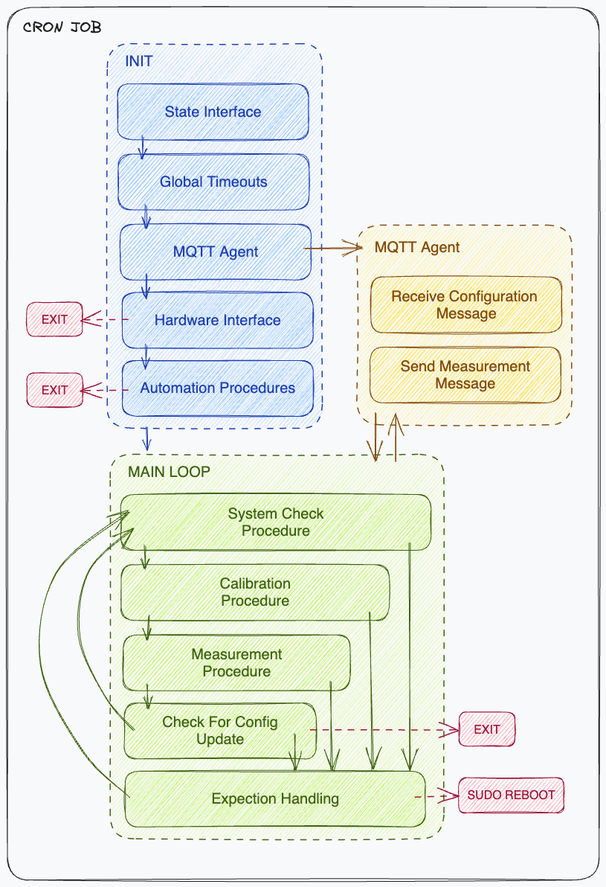

# Hermes - Driving The ACROPOLIS Network

Hermes is a management software for autonomous sensor networks. 

It consists of three parts: The sensor system, the server, and the dashboard.

The systems run autonomously and communicate with the server via MQTT. The server stores the data in a database and provides a REST API for data download and the dashboard.

 

## 🎯 Main goals

1. Observe system status and measurements in real-time
2. Update the system configuratuon remotely
3. Update the system software remotely
4. Easy setup and deployment of Hermes Infrastructure

 

## 📦 Practical usage

This software is developed for the ACROPOLIS network. The goal of ACROPOLIS is to measure CO2 concentrations in the city of Munich. The network spans 20 roof-top systems.

 

## 🔨 Sensor System

 

## 🔨 Software Architecture

 

## 🪄 Dashboard

Built using React, NextJS, TailwindCSS, and TypeScript.

