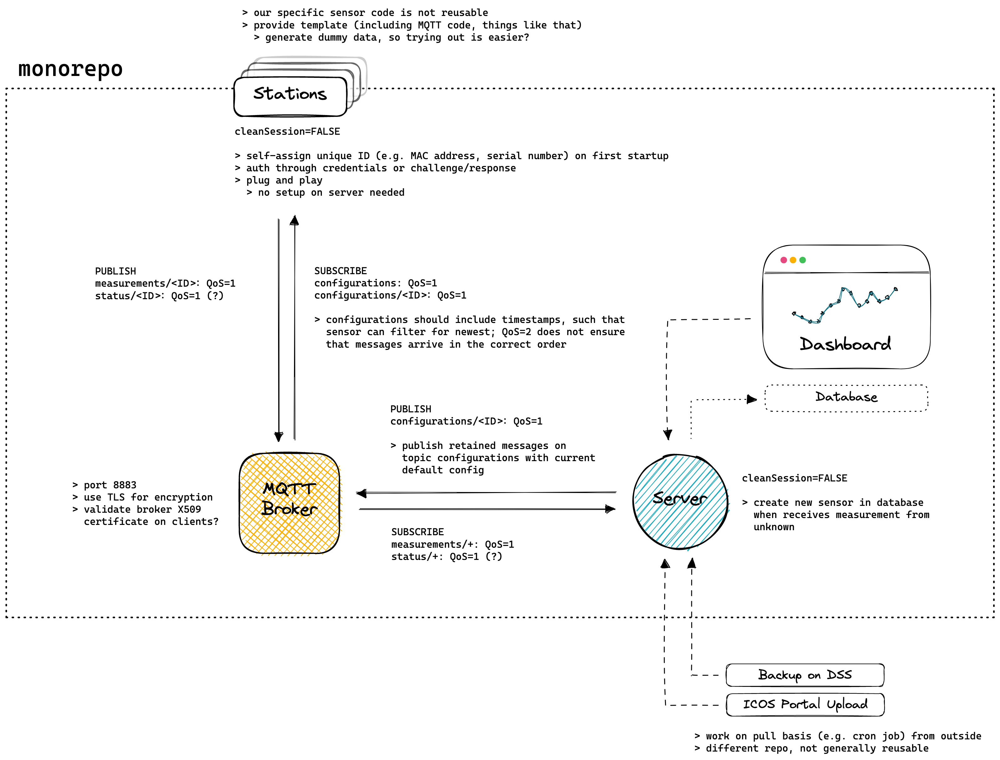
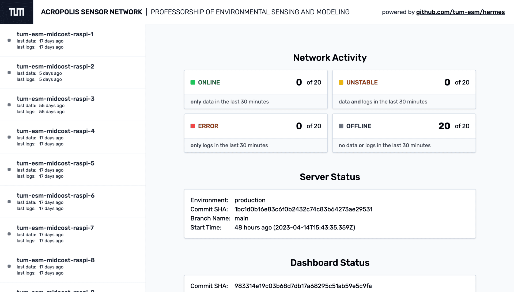
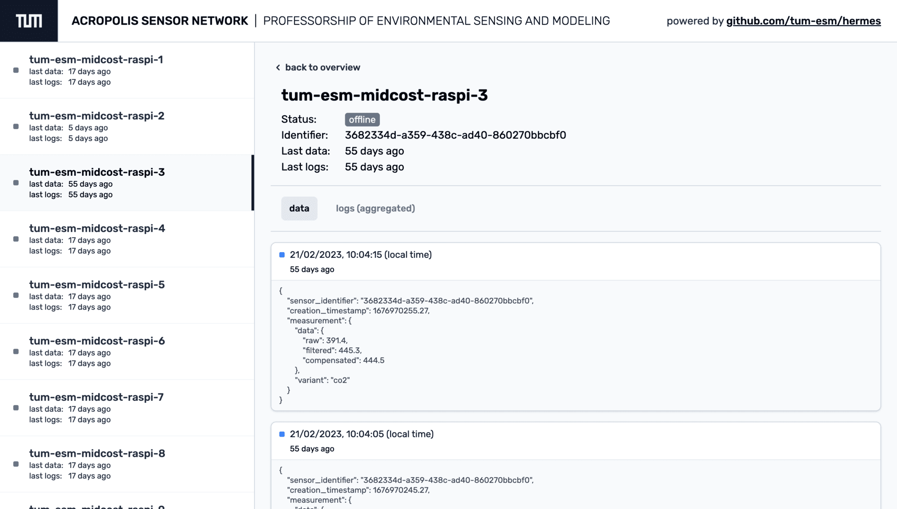

# Hermes - Driving The ACROPOLIS Network

Here, a management software for autonomous sensor networks is created.

The system is made of three parts: the sensors system, the server, and the dashboard.

The sensors communicate with the server via MQTT. The server stores the data in a database and provides a REST API for the dashboard.

 

## 🎯 Main goals

1. The status and measurements of the sensors can be observed in real-time and remotely
1. The sensors can be configured remotely
1. The software on the sensors can be updated remotely
1. Easy setup and deployment of Hermes

 

## 📦 Practical usage

This software is developed for the ACROPOLIS network. The goal of ACROPOLIS is to measure CO2 concentrations in the city of Munich. The network spans 20 sensors.

 

## 🔨 Structure

 

## 🪄 Hermes Dashboard

Built using React, NextJS, TailwindCSS, and TypeScript.

Some impressions:

