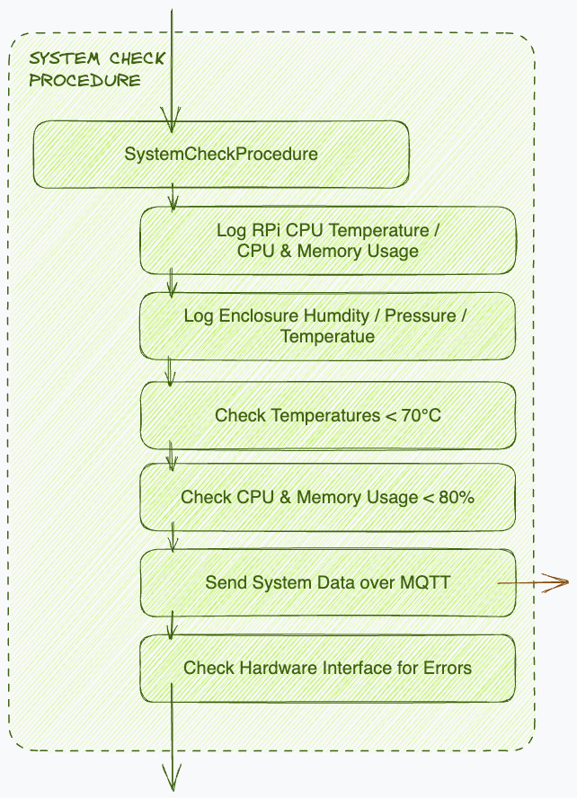
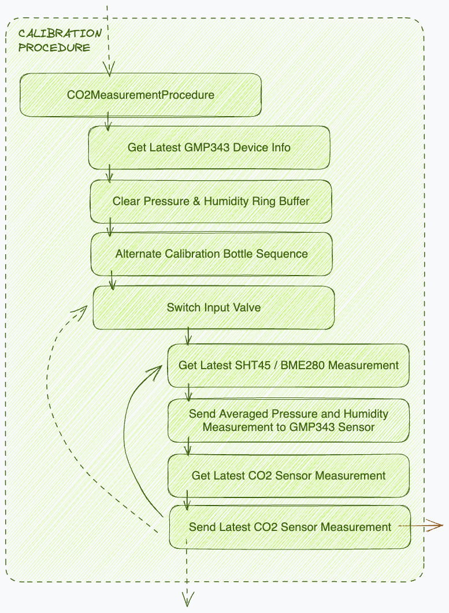
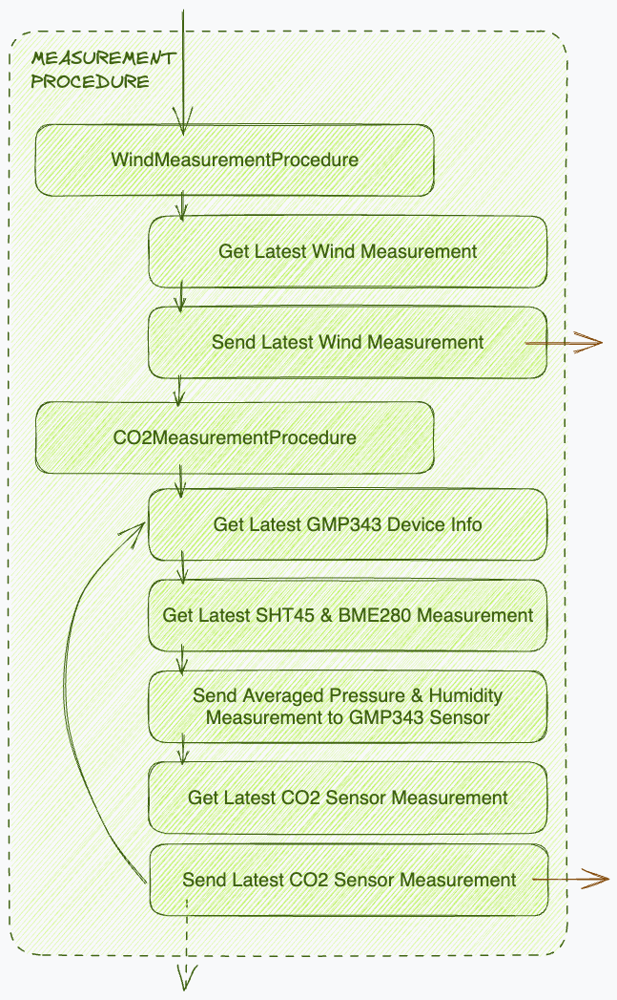
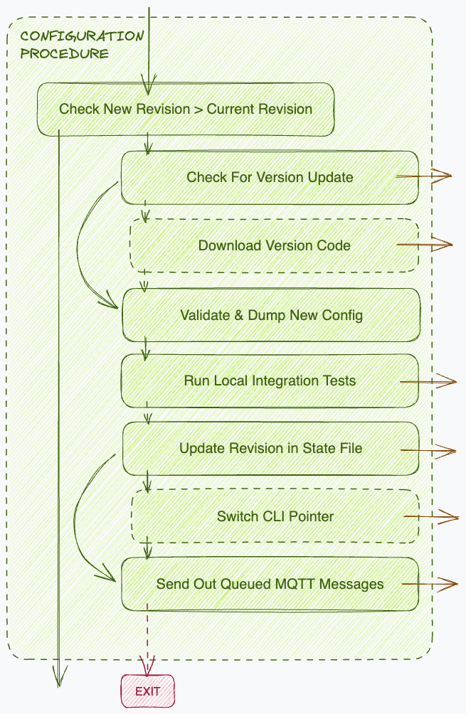
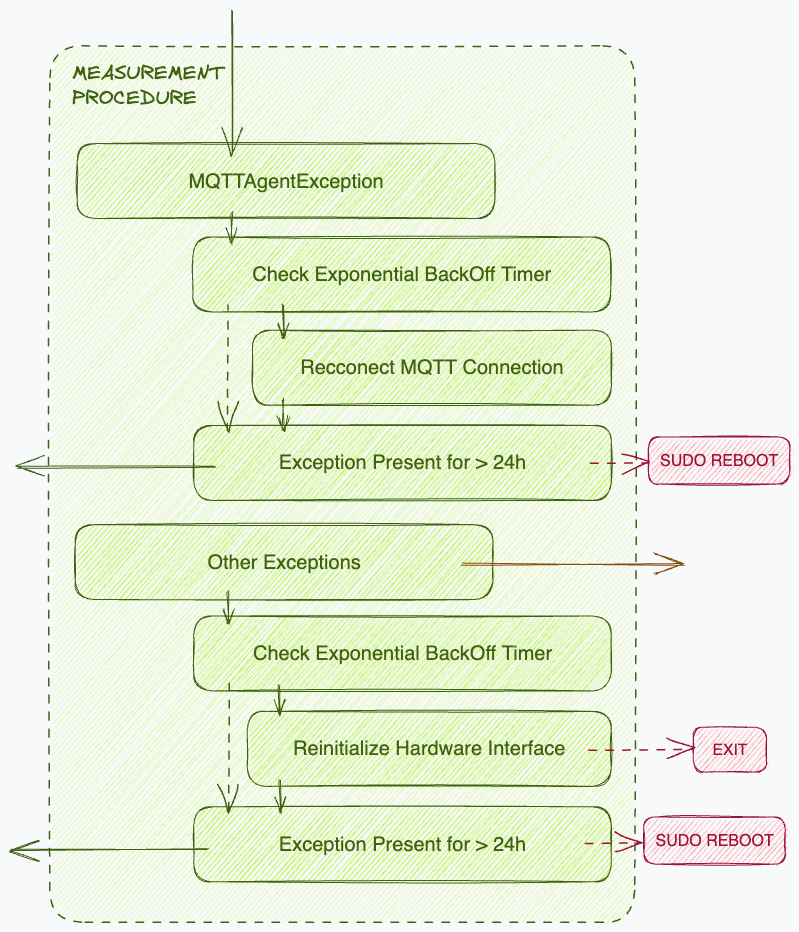

## Installation

**Set up virtual environment and install dependencies:**

```bash
python3.9 -m venv .venv
source .venv/bin/activate
poetry install --with=dev
```

**Run tests/check static types:**

```bash
# all tests
pytest --cov=src --cov=cli tests/

# only ci tests
pytest -m "ci" --cov=src --cov=cli tests/

# only integration tests
pytest -m "integration" --cov=src --cov=cli tests/

#test static types
bash ./scripts/check_static_types.sh
```

## System release & update process

1. Create a new release
   1. Merge all changes into the `main` branch
   2. Check whether the GitHub CI tests were successful for this commit
   3. Tag the commit as `v0.1.0-beta.3` (or whatever the new version is)
   4. Create a release on GitHub with the same tag (`v0.1.0-beta.3`)
   5. Write release notes


2. Update the `config.json` that is sent to the system
    ```json
    {
        "version": "0.1.0-beta.3",
        ...
    }
    ```

3. Wait for the system to confirm the update with new revision

## Visualisation

### Automation


### Main Loop

**System Check Procedure**



**Calibration Procedure**



**Measurement Procedure**



**Configuration Procedure**



**Exception Handling**




